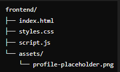
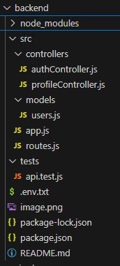

# Matchify

A dating app that connects users based on interests, preferences, and location.

Here’s the complete implementation of the frontend application for Task 1:

Create Project Folder:

    Create a folder named frontend for the application.

Project Structure:
                    frontend/
                        ├── index.html

      //index.html

                <!DOCTYPE html>

                <html lang="en">

                <head>

                <meta charset="UTF-8">

                <meta name="viewport" content="width=device-width, initial-scale=1.0">

                <title>Matchify - Profile Creation</title>

                <link rel="stylesheet" href="styles.css">

                </head>

                <body>

                

                    <h1>Create Your Profile</h1>

                    <form id="profileForm">

                    <label for="name">Name:</label>

                    <input type="text" id="name" name="name" required>

                    <label for="age">Age:</label>

                    <input type="number" id="age" name="age" min="18" max="100" required>

                    <label for="gender">Gender:</label>

                    <select id="gender" name="gender" required>

                        <option value="" disabled selected>Select Gender</option>

                        <option value="male">Male</option>

                        <option value="female">Female</option>

                        <option value="other">Other</option>

                    </select>

                    <label for="location">Location:</label>

                    <input type="text" id="location" name="location" required>

                    <label for="interests">Interests:</label>

                    <textarea id="interests" name="interests" rows="4" required></textarea>

                    <label for="profilePicture">Profile Picture:</label>

                    <input type="file" id="profilePicture" name="profilePicture" accept="image/*" required>

                    <button type="submit">Submit</button>

                    </form>

                    
Profile created successfully!

                

                

                </body>

                </html>

                //styles.css

                            body {

                            font-family: Arial, sans-serif;

                            background-color: #f9f9f9;

                            color: #333;

                            margin: 0;

                            padding: 0;
                            
                            display: flex;

                            justify-content: center;

                            align-items: center;

                            height: 100vh;

                            }

                            .container {

                            background: white;
                            
                            padding: 20px;

                            border-radius: 8px;

                            box-shadow: 0 4px 10px rgba(0, 0, 0, 0.1);

                            width: 100%;

                            max-width: 400px;

                            }

                            h1 {

                            text-align: center;

                            margin-bottom: 20px;

                            }

                            label {

                            font-weight: bold;
                            
                            margin-top: 10px;

                            display: block;

                            }

                            input, select, textarea, button {

                            width: 100%;

                            margin-top: 5px;

                            margin-bottom: 15px;

                            padding: 10px;

                            border: 1px solid #ccc;

                            border-radius: 5px;

                            font-size: 16px;

                            }

                            button {

                            background-color: #28a745;

                            color: white;

                            border: none;

                            cursor: pointer;

                            }

                            button:hover {

                            background-color: #218838;

                            }

                            .hidden {

                            display: none;

                            }

                            #successMessage {

                            margin-top: 20px;

                            text-align: center;

                            font-weight: bold;

                            color: #28a745;

                            }

                 

                 // script.js

                                document.getElementById('profileForm').addEventListener('submit', function(event) {

                                    event.preventDefault();

                                    const name = document.getElementById('name').value;

                                    const age = document.getElementById('age').value;

                                    const gender = document.getElementById('gender').value;

                                    const location = document.getElementById('location').value;

                                    const interests = document.getElementById('interests').value;

                                    const profilePicture = document.getElementById('profilePicture').files[0];

                                    if (!name || !age || !gender || !location || !interests || !profilePicture) {

                                        alert('Please fill out all fields.');

                                        return;
                                    }

                                    if (!profilePicture.type.startsWith('image/')) {

                                        alert('Please upload a valid image file.');

                                        return;
                                    }

                                    document.getElementById('successMessage').classList.remove('hidden');
                                });

***Execution Steps:
        Place the code files in the frontend directory.

            From frontend directory:

                run the below steps:

                    Install the serve package globally:

                        --npm install -g serve

                    Confirm path to the frontend directory:

                        --cd path/to/frontend

                    Start the server:

                        --serve

                    Open your browser and visit the displayed URL.

           Test the form functionality:

            Fill in all fields and upload a valid image.

            Submit the form and observe the success message.

            Test with invalid or missing fields to ensure proper validation.

**To achieve Step 2, including the development of the WebDriverIO and Appium test scripts and all necessary components.

Step 1: Set Up Your Project

Create a New Directory

    Create a directory, e.g., profile-form-tests.

Initialize the Project

    Run the following commands to set up the project:

       -- mkdir profile-form-tests

            --cd profile-form-tests

                --npm init -y

                Install dependencies for WebDriverIO and Appium:

                    --npm install @wdio/cli webdriverio appium appium-doctor @wdio/local-runner @wdio/mocha-framework @wdio/spec-reporter --save-dev

Configure WebDriverIO

Run the WebDriverIO configuration wizard:

    --npx wdio config

Choose the following options during the setup:

    Test runner: local

    Framework: mocha

    Reporters: spec

    Services: chromedriver

    Base URL: http://localhost:3000

Set Up Appium (For Mobile Automation)

    Ensure Appium is installed globally:

        --npm install -g appium

        --npm install -g appium-doctor

        --appium-doctor

    Start the Appium server:

        --appium

        Install Command-Line Tools (Without Android Studio)

            Download Command-Line Tools:

            Go to the Android Command Line Tools and download the "Command Line Tools Only" package for your OS.

        Install Command-Line Tools:

            Extract the downloaded ZIP file to a directory, e.g., C:\AndroidSDK.

        Install SDK Manager:

            Open a terminal or command prompt, navigate to the tools/bin folder, and run

            --.\sdkmanager.bat --list --sdk_root="C:\Path\To\AndroidSDK"

            Accept the license agreements by typing yes when prompted.

        Download Required SDK Components:

            Install platform-tools and the desired SDK version (e.g., API 33):

                --.\sdkmanager.bat "platform-tools" "platforms;android-33" --sdk_root="C:\Path\To\AndroidSDK"

            Navigate to the Directory: Open a terminal (Command Prompt or PowerShell) and navigate to the directory where sdkmanager.bat is located:

            Verify Installation: After the command runs successfully, verify the installation by listing the installed packages:

                --.\sdkmanager.bat --list --sdk_root="C:\Path\To\AndroidSDK"

    Requirements:

        Make sure java is installed

            if no:

                    Set the JAVA_HOME Environment Variable

            Steps:

    Locate the path to your Java Development Kit (JDK) installation folder. For example:

        C:\Program Files\Java\jdk-XX.X.XX

        Replace XX.X.XX with your installed JDK version.

    Set the environment variable:

    Open Environment Variables settings:

    Press Win + R, type sysdm.cpl, and press Enter.

    Go to the Advanced tab and click Environment Variables.

    Under System variables, click New and add:

    Variable name: JAVA_HOME

    Variable value: C:\Program Files\Java\jdk-XX.X.XX

    Add %JAVA_HOME%\bin to your Path variable:

    Find the Path variable under System variables, click Edit.

    Click New, and add:

        %JAVA_HOME%\bin

    Verify it’s set:

    Open a new Command Prompt and run:

        --echo %JAVA_HOME%

    It should output the JDK path.

    Then check Java version:

        --java -version

Step 2: 

Wrote WebDriverIO and Appium Test Scripts

Positive Test Case:

Fill all fields, upload a valid image, submit, and verify the success message.

Negative Test Cases:

Submitted the form with missing mandatory fields.

Uploaded invalid image types

Backend:

Expected backend file structure:

Install dependencies:

--npm install

Run the app:

--npm start

Run tests:

--npm test

Expected result:

Automation Testing:

To analyze and refactor the flaky test script, 

let's first outline the potential causes for flakiness and then provide a refactored version of the script with comments explaining the changes.

Potential Causes for Flakiness

Timing Issues: The test might not be waiting for elements to be available before interacting with them.

Hardcoded Waits: Using fixed sleep times instead of waiting for specific conditions can lead to flakiness.

Element Locators: Unreliable or dynamic element locators can cause the test to fail intermittently.

Network Delays: Network-related delays can cause the test to fail if not handled properly.

Refactored Script

Below is the refactored version of the test script with comments explaining the changes made to improve reliability.

    const { remote } = require('webdriverio');

    let browser;

    before(async function() {
        this.timeout(20000); // Increase timeout to 20 seconds

        // Initialize browser session
        browser = await remote({
            logLevel: 'error',
            path: '/',
            port: 9516,
            capabilities: {
                browserName: 'chrome',
                'goog:chromeOptions': {
                    args: ['--headless', '--disable-gpu']
                }
            }
        });
    });

    after(async function() {
        if (browser) {
            await browser.deleteSession();
        }
    });

    describe('Login Feature', function() {
        it('should login successfully with valid credentials', async function() {
            this.timeout(30000); // Increase timeout to 30 seconds

            // Navigate to login page
            await browser.url('http://localhost:3000/login');

            // Wait for the login form to be displayed
            const loginForm = await browser.$('#loginForm');
            await loginForm.waitForDisplayed();

            // Enter username
            const usernameInput = await browser.$('#username');
            await usernameInput.setValue('testuser');

            // Enter password
            const passwordInput = await browser.$('#password');
            await passwordInput.setValue('password123');

            // Click login button
            const loginButton = await browser.$('#loginButton');
            await loginButton.click();

            // Wait for the dashboard to be displayed
            const dashboard = await browser.$('#dashboard');
            await dashboard.waitForDisplayed();

            // Assert that the dashboard is displayed
            const isDashboardDisplayed = await dashboard.isDisplayed();
            assert.strictEqual(isDashboardDisplayed, true, 'Dashboard should be displayed after login');
        });
    });

Documentation

Root Causes of Flakiness

Timing Issues: The original script might not have been waiting for elements to be available before interacting with them, 

leading to intermittent failures.

Hardcoded Waits: Fixed sleep times can cause the test to fail if the application takes longer to respond.

Element Locators: Unreliable or dynamic element locators can cause the test to fail intermittently.

Steps Taken to Resolve Issues

Increased Timeouts: Increased the timeout for the test and browser session to handle slower responses.

Explicit Waits: Used explicit waits (waitForDisplayed) to ensure elements are available before interacting with them.

Reliable Element Locators: Used reliable element locators (e.g., IDs) to interact with elements.

Headless Mode: Ensured the browser runs in headless mode with necessary options to avoid graphical issues.

By implementing these changes, the test script should be more reliable and less prone to flakiness.

##flaky test script

flaky test script:

Login Page URL:

