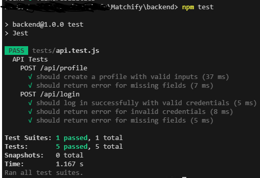

# Matchify Backend API

## Setup
1. Clone the repository:
   ```bash
   git clone <repository-url>
   cd backend


Install dependencies:


--npm install


Run the app:


--npm start


Run tests:


--npm test


Expected result:


